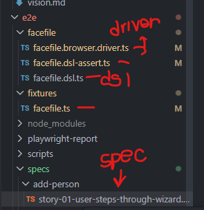
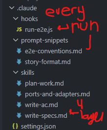
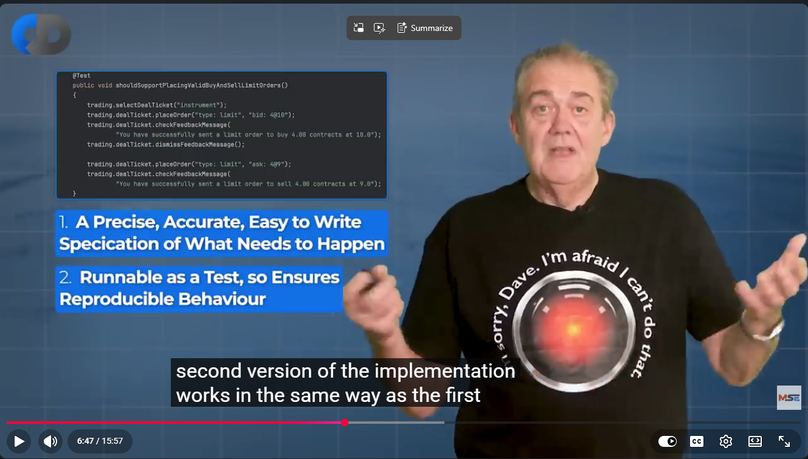

# Executable Specification

When our developers start working on the feature described in the specification with the example created above, the test based on this specification will initially fail because it's not yet automated and the feature isn't yet implemented. The developers will implement the relevant feature and connect it to the test automation framework. They'll use a test automation framework which pulls the inputs from the specification and validates the expected outputs without requiring them to actually change the specification document. This could be plain old java with JUnit, or something like Gherkin and Cucumber. It is up to the team implementing. I personally prefer plain old java, but teams may choose whatever they find the most expressive.

[*A full working example in java can be seen here.*](https://github.com/davef77/atdd-course-examples/tree/master)

Ideas and practices such as the following will help automate the specification efficiently:

- Run the System Under Test (SUT) as production like as possible, without running it end to end.
- Simulate external systems with system stubs.
- Create a Domain Specific Language (DSL) layer to turn the plain language of the business, i.e. the "HOW" into complete test fixtures for each example.
  - Consider using a DSL in the native language (TypeScript, Java, etc.)
  - Consider using a DSL using Gherkin or Cucumber
- Create **temporal isolation** in the DSL using aliases for potential test constraint conflicts.
- Use a **Protocol driver** to drive the tests at the layer of abstraction desired. E.g. a UI protocol driver or REST API driver.
- Use the DSL to control the external systems that stubs the System Under Test (SUT) uses as part of the Component Test.
- The test calls the DSL. The DSL calls the driver. The protocol driver translates the instructions to the protocol required to connect to the system.
- Relentlessly focus the language on the end user in the language of the domain, understood without implementation details.
- Find ways to skip the tests until they are implemented but allow them to be executed individually as needed during development.

## 4 Layer Architecture

You started with a specification that could be applied manually with validations. But once the validation is automated, the specification becomes executable!

I've heard most developers and managers in the industry these days say things like:

"Brent, it's too expensive to write tests like this."

to which I say, "How much does it cost to maintain your software without it?"

And especially today, you can train your AI on a model repos, such as Dave Farley's, add that to your skills and agents, and your AI will do it for you.

[github.com/davef77/atdd-course-examples](https://github.com/davef77/atdd-course-examples)

Additionally, I have ported this 4 layer architecture here, along with functional examples that run against an application built this way.

Additionally, you can copy the claude skills, hooks and prompt-snippets to ask claude to do it for you!

For this assignment, I challenge you to try at least one or two tests like this. I find that when my projects maintain the code with these tests, I'm much more able to add features by myself, and AI is able to take these into context as well to maintain a system that continues to function according to the product vision and user goals.

[See More from Dave Farley himself:]()

[I]()f you really want to learn more, you can take his courses, which I highly recommend.

[courses.cd.training/courses/take/atdd-from-stories-to-executable-specifications](https://courses.cd.training/courses/take/atdd-from-stories-to-executable-specifications)
