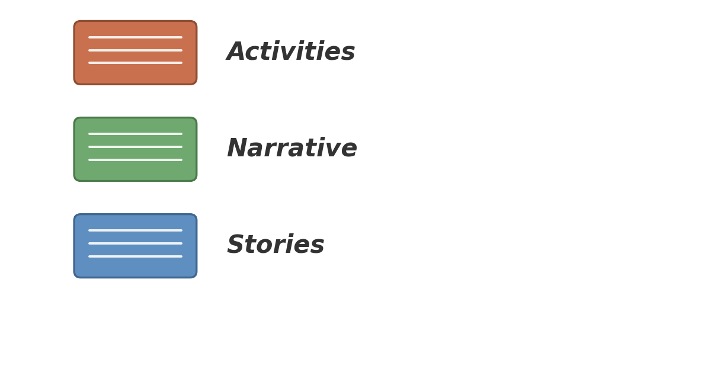
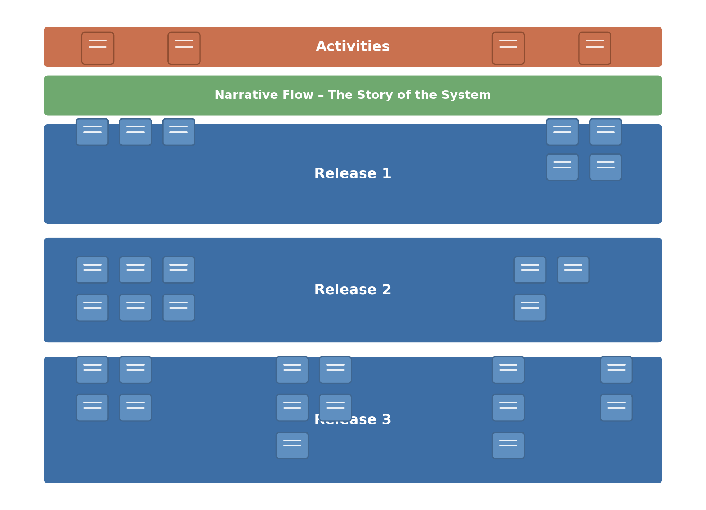
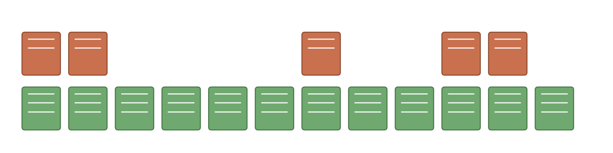
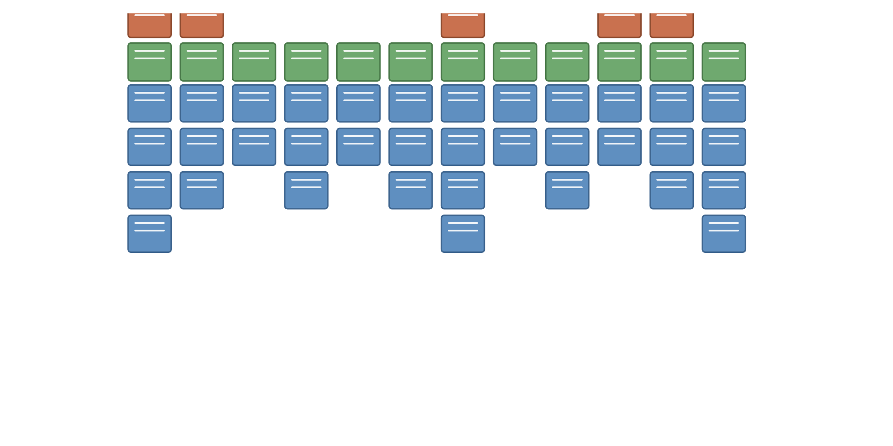
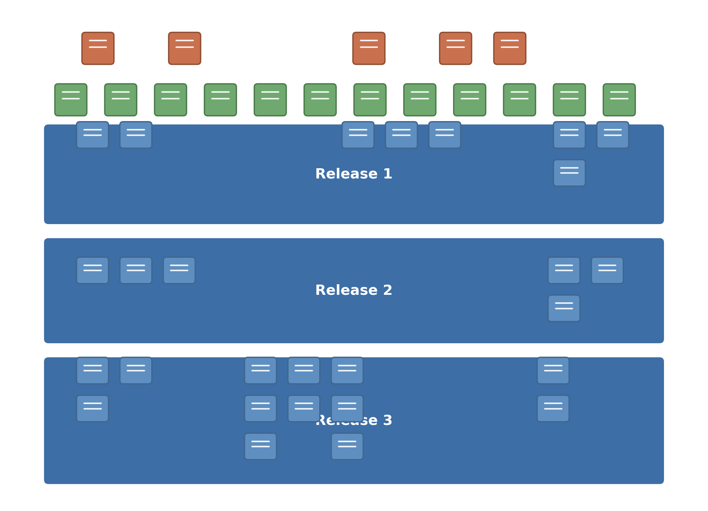

# Exercise 2 — Story Mapping

## Overview

In this exercise, we will create a simple story map. We'll use something that we are all familiar with, and that doesn't have much to do with software, so that we can concentrate on the activity, rather than any technicalities.

## Goals of the Exercise

Our aim is to create a story map that accurately captures your activities, as you get up and get ready to go out to work. We will use the mapping exercise to represent the three levels of detail, **Narrative**, **Activities** and **Stories**.

Finally we will re-work our map to plan 'releases'.

# Exercise

## Introduction

If you can find a group of people we recommend that you do this exercise in small groups. This exercise is best done in groups of 2–5.

It is most fun, if you are able to get together in a room, with a stack of sticky notes in 3 different colours. The actual colours don't matter, but assign them meaning:

If you can't get together in person, [Mural](https://www.mural.co/), or similar, is a good alternative, if you can assemble a small group online. You can do this alone too, but there is usually more laughing involved when you do it in groups :-)

## Step 1. Getting Up

Begin with the **Narrative**. Think about the sequence of things, or events, that happen from waking up to going out the door on your way to work.

*e.g. "Wake up", "Shower", "Prepare Breakfast", "Eat Breakfast", "Catch up on the News", "Feed the Kids", …*

Once you have the narrative, try to identify the **Activities**.

*e.g. "Get up", "Get Clean", "Eat", …*

Now get into the detail — think of all the little things that you need to do to fulfil this narrative, these are your **Stories**.

*e.g. Under "Wake Up": "Alarm on snooze", "wake up again", "get out of bed", "tidy the bed", …*

## Advice

If you are doing this as a group, don't worry about all the differences between your routines, just pick a reasonable average.

If you are doing this in person as a group, try to avoid one person doing all the writing, encourage everyone to write entries and add them to the map.

Try to avoid repeating the **Narrative** in the **Activities**. **Activities** should describe things at a slightly higher level of abstraction.

**_DON'T MOVE ON UNTIL YOUR MAP IS "FINISHED".​_**

## Step 2. Prioritising Things

Now you have your map, we are going to change the scenario.

Instead of you waking up in the normal way, you are woken by a phone call. At the end of the line is your co-worker who says:

> *"It's all falling apart, you need to get in here right now".*

So now your challenge is to move all the cards that aren't essential down in your map. Will you still take a shower, walk the dog, brush your teeth?

Anything that isn't absolutely essential to getting out the door and off to work, should be moved out.

What is left is your first 'release' — the stuff that you must have.